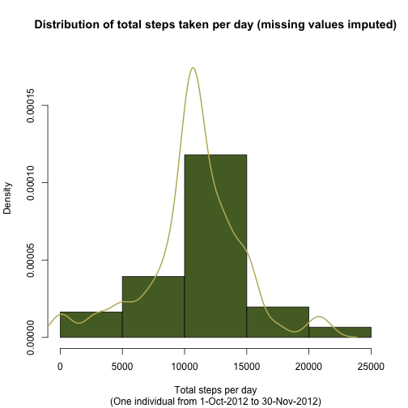
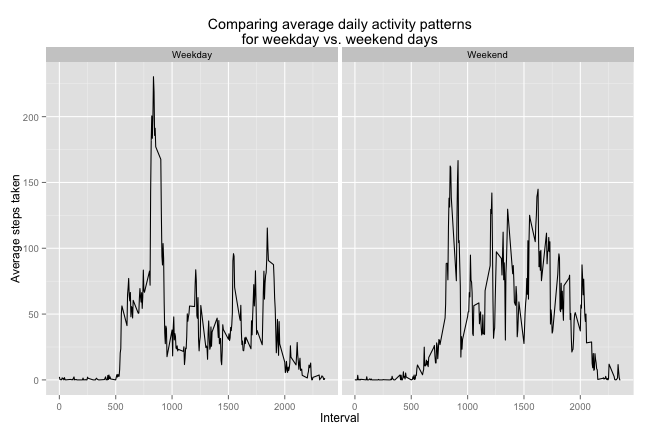

## Reproducible Research
#### November 2015
#### Peer Assessment 1

### Loading and preprocessing the data

We'll start by loading the data file.


```r
library(dplyr)
library(ggplot2)
library(lubridate)

unzip("activity.zip")
act <- read.csv("activity.csv", header=TRUE)
file.remove("activity.csv")
```

```
## [1] TRUE
```

```r
# Change date from a factor to a true date.
act$date <- ymd(act$date)
```


### What is the mean total number of steps taken per day?

Make a histogram of the total number of steps taken each day.

```r
act_by_day <- group_by(act, date)
total_steps_per_day <- summarise(act_by_day, sum(steps, na.rm=TRUE))
names(total_steps_per_day) <- c("day", "total_steps")
hist(total_steps_per_day$total_steps, prob=TRUE,
     main="Distribution of total steps taken per day",
     sub="(One individual from 1-Oct-2012 to 30-Nov-2012)",
     xlab="Total steps per day", col="bisque1")
lines(density(total_steps_per_day$total_steps), lwd=2,
      col="saddlebrown")
```

 

Calculate and report the mean and median total number of steps taken
per day.

```r
avg_total_steps_per_day <- mean(total_steps_per_day$total_steps)
med_total_steps_per_day <- median(total_steps_per_day$total_steps)
```
The average total number of steps per day is 9354.2.
The median total number of steps per day is 10395.0.


### What is the average daily activity pattern?

Make a time series plot of the 5-minute intervals and the average
number of steps taken, averaged across all days.

```r
act_by_interval <- group_by(act, interval)
avg_steps_per_interval <- summarise(act_by_interval,
                                    mean(steps, na.rm=TRUE))
names(avg_steps_per_interval) <- c("interval", "avg_steps")
plot(avg_steps_per_interval$interval,
     avg_steps_per_interval$avg_steps,
     type="l", lwd=2, col="salmon",
     main="Daily activity pattern of a single participant",
     xlab="Interval", ylab="Average steps taken")
```

 

Which 5-minute interval, on average across all days in the data set,
contains the maximum number of steps?

```r
max_avg_steps <- avg_steps_per_interval$interval[
    which.max(avg_steps_per_interval$avg_steps)]
```
Interval 835 contains the maximum number of steps.

### Imputing missing values

There are 2304 missing values in the data set.  

Let's fill in those missing values using the average number of steps
taken in each interval found above, rounded to the nearest integer.  

For each row, we first check if the value of steps is missing. If it
is, we store the interval number of that row, and use it to get the
average number of steps for the interval from the data frame we
created above (called avg_steps_per_interval). We then round the
average to the nearest integer.

```r
for (i in seq(nrow(act))) {
    if (is.na(act$steps[i])) {
        interval_num <- act$interval[i]
        act$steps[i] <- round(avg_steps_per_interval$avg_steps[
            avg_steps_per_interval$interval == interval_num],
            digits=0)
    }
}
```

Make a histogram of the total number of steps taken each day and
calculate and report the mean and median total number of steps taken
per day.

```r
act_by_day <- group_by(act, date)
total_steps_per_day <- summarise(act_by_day, sum(steps, na.rm=TRUE))
names(total_steps_per_day) <- c("day", "total_steps")
hist(total_steps_per_day$total_steps, prob=TRUE, ylim=c(0, 0.00018),
     main=paste("Distribution of total steps taken per day",
                "(missing values imputed)", sep=" "),
     sub="(One individual from 1-Oct-2012 to 30-Nov-2012)",
     xlab="Total steps per day", col="darkolivegreen")
lines(density(total_steps_per_day$total_steps), lwd=2,
      col="darkkhaki")
```

 

```r
new_avg_total_steps_per_day <- mean(total_steps_per_day$total_steps)
new_med_total_steps_per_day <- median(total_steps_per_day$total_steps)
```

The average total number of steps per day is 10765.6. The median total number of steps per
day is 10762.0.  

Imputing the missing values with the strategy outlined above
eliminated the heavy left tail of the original distribution of average
total steps per day. The distribution of the new data set is now much
more symmetric. The overall mean total steps per day changed quite
substantially as a result, from 9354.2 to 10765.6. On the other hand, the median, which is
more robust to changes in parts of the data set, did not shift by as
much, going from 10395.0 to 
10762.0.


### Are there any difference in activity patterns between weekdays and
### weekends?

Create a new factor variable in the dataset with two levels, "weekday"
and "weekend", indicating whether a given date is a weekday or weekend
day.

```r
act$day_of_week <- weekdays(act$date)
act$wknd_code <- ifelse(act$day_of_week %in% c("Saturday", "Sunday"),
                        "Weekend", "Weekday")
act$wknd_code <- factor(act$wknd_code)
```

Make a time series plot of the 5-minute intervals and the average
number of steps taken, averaged across all weekday or weekend days.

```r
wkdy_avg_steps_per_interval <- act %>%
    group_by(wknd_code, interval) %>%
    summarise(mean(steps))
names(wkdy_avg_steps_per_interval) <- c("wknd_code", "interval",
                                        "avg_steps")
p <- ggplot(wkdy_avg_steps_per_interval,
            aes(x=interval, y=avg_steps)) +
    ggtitle(paste("Comparing average daily activity patterns",
                  "for weekday vs. weekend days", sep="\n")) +
    xlab("Interval") + ylab("Average steps taken") +
    geom_line() +
    facet_wrap(~ wknd_code)
p
```

 
